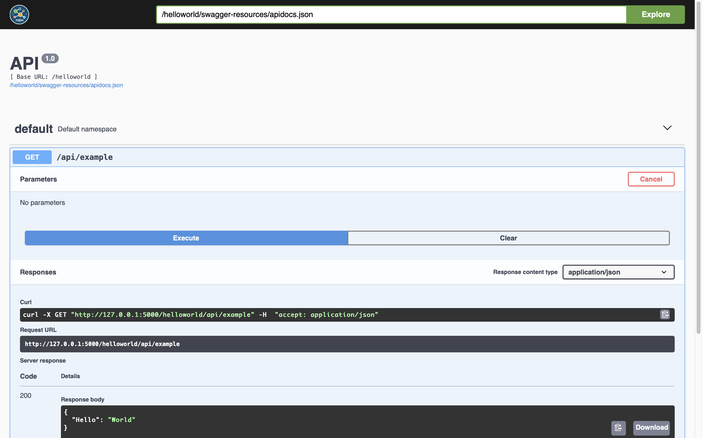
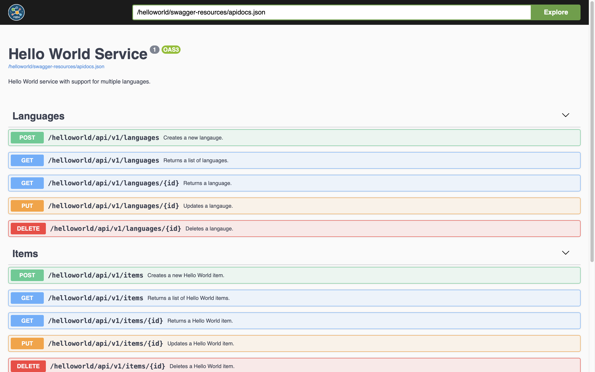
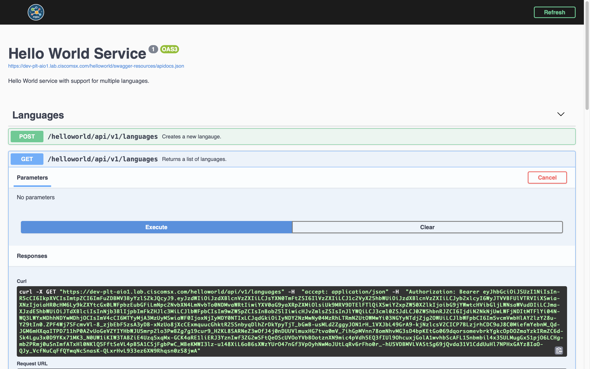

# msxswagger
* [Introduction](#introduction)
* [Prerequisites](#prerequisites)
* [Installation](#installation)
  * [Command Line](#command-line)
  * [requirements.txt](#requirementstxt)
* [Getting Started](#getting-started)
    * [Swagger Annotations](#swagger-annotations)
    * [OpenAPI Specifications](#openapi-specifications)
* [Adding Security](#adding-security)
    * [Creating the Security Client](#creating-the-security-client)
    * [Configuring MSX SSO](#configuring-msx-sso)
* [Configuration Options](#configuration-options)
    * [Documentation Config](#documentation-config)
    * [Security](#security)


## Introduction
This module adds Swagger UI to Flask applications, based on annotated routes or an OpenAPI specification document.


## Prerequisites
- python3
- pip3
- Flask


## Installation
### Command Line
To install `msxswagger` from the command line run the command below.
```bash
$ pip3 install git+https://github.com/CiscoDevNet/python-msx-swagger
```

### requirements.txt
To include `msxswagger` as a dependency in `requirements.txt include it as shown:
```bash
Flask==2.0.3
Flask-Cors==3.0.10
flask-restx==0.5.1
Werkzeug==2.0.3
msxswagger @ git+https://github.com/CiscoDevNet/python-msx-swagger
```


### Swagger Annotations
A small Flask application that populates the Swagger from annotations looks like this:
```python
from flask import Flask
from flask_restx import Resource
from msxswagger import MSXSwaggerConfig, DocumentationConfig


class ExampleApi(Resource):
	def get(self):
		return {"Hello": "World"}


app = Flask(__name__)
documentation_config = DocumentationConfig(root_path='/helloworld',)
swagger = MSXSwaggerConfig(app, documentation_config)
swagger.api.add_resource(ExampleApi, "/api/example")
app.register_blueprint(swagger.api.blueprint)

if __name__ == '__main__':
	app.run()

```
Start the application and open `http://localhost:5000/helloworld/swagger` in a browser.



<br>

### OpenAPI Specifications
To display the OpenAPI specification from a JSON file, pass the resource name in when you create `MSXSwaggerConfig`.
```python
from flask import Flask
from msxswagger import MSXSwaggerConfig, DocumentationConfig
from controllers.items_controller import ItemsApi, ItemApi
from controllers.languages_controller import LanguageApi, LanguagesApi

app = Flask(__name__)
documentation_config = DocumentationConfig(root_path='/helloworld')
swagger = MSXSwaggerConfig(app, documentation_config, swagger_resource="swagger.json")

swagger.api.add_resource(ItemsApi, "/api/v1/items")
swagger.api.add_resource(ItemApi, "/api/v1/items/<id>")
swagger.api.add_resource(LanguagesApi, "/api/v1/languages")
swagger.api.add_resource(LanguageApi, "/api/v1/languages/<id>")
app.register_blueprint(swagger.api.blueprint)

if __name__ == '__main__':
	app.run()
```

You will have to write boilerplate implementations of the controller classes before this application will run. Once you have, start the application and open `http://localhost:5000/helloworld/swagger` in a browser.



<br>

## Adding Security
If you need your API requests to include an MSX access token in the header you will need to do few things:
* create an MSX public security client
* configure your `MSXSwaggerConfig` for MSX SSO
* test on an MSX environment


### Creating the Security Client
You must create a public security client in your Cisco MSX Portal first. You can either do this through `Settings->SSO Configurations->Add SSO Clients` or using Swagger. To find the correct Swagger page click on your user name in the top left-hand corner, select `Account Settings`, scroll down and click `Swagger UI`, then select `IDM Microservice`. Make a security client using `POST /idm/api/v2/clientsecurity` and the payload below.
```json
{
    "clientId":"my-public-security-client",
    "grantTypes":[
        "refresh_token",
        "authorization_code"
    ],
    "maxTokensPerUser":-1,
    "useSessionTimeout":false,
    "resourceIds":[
    ],
    "scopes":[
        "address",
        "read",
        "phone",
        "openid",
        "profile",
        "write",
        "email"
    ],
    "autoApproveScopes":[
        "address",
        "read",
        "phone",
        "openid",
        "profile",
        "write",
        "email"
    ],
    "authorities":[
        "ROLE_USER",
        "ROLE_PUBLIC"
    ],
    "registeredRedirectUris":[
        "/**/swagger-sso-redirect.html"
    ],
    "accessTokenValiditySeconds":9000,
    "refreshTokenValiditySeconds":18000,
    "additionalInformation":{
    }
}
```

### Configuring MSX SSO
The example below shows how to enable Swagger security and configure MSX SSO. Remember to update `sso.base_url` and `sso.client_id` with values for your MSX environment and the security client you created respectively.

```python
from flask import Flask
from flask_restx import Resource
from msxswagger import MSXSwaggerConfig, DocumentationConfig, Sso, Security


class ExampleApi(Resource):
	def get(self):
		return {'Hello': 'World'}, 200


app = Flask(__name__)

sso = Sso(
	base_url='https://MY_MSX_ENVIRONMENT/idm',
	client_id='my-public-security-client')

documentation_config = DocumentationConfig(
	root_path='/helloworld',
	security=Security(True, sso))

swagger = MSXSwaggerConfig(app, documentation_config)
swagger.api.add_resource(ExampleApi, "/api/example")
app.register_blueprint(swagger.api.blueprint)


if __name__ == '__main__':
	app.run()
```

Once you have deployed and run an application that has security enabled, all requests will be automatically passed the MSX access token for the current user. Your service can exchange the access token for a security context. The security context contains all the information required for your application to implement RBAC and Tenancy.



<br>


## Configuration Options
The class `MSXSwaggerConfig` takes three parameters:`
* a Flask application reference
* a Swagger Documentation Config instance
* an optional OpenAPI specification resource (e.g. swagger.json)


### Documentation Config
There are default values for most properties in this object, and often you will only have to set `root_path`.

| Name           | Default            | Description |
|----------------|--------------------|-------------|
| root_path      |                    | The root path that other routes will be appended to. |
| ui_path        | /swagger           | The path the Swagger UI will be served from. |
| resource_path  | /swagger-resources | An internal value used to configure Swagger resources. |
| api_path       | /apidocs.json      | An internal value used to configure Swagger resources. |
| spec_version   | 3.0.0              | The Swagger version to render. |
| security       | Security(False)    | SSO settings for integrating with MSX. |


### Security
Again there sensible default for some properties. In some cases you will just need to disable security, but if you enable in most cases you will only need to set `sso.base_url` and `sso.client_id`.

| Name               | Default                   | Description |
|--------------------|---------------------------|-------------|
| enabled            | False                     | Disable or enable MSX SSO integration. |
| sso.base_url       | http://localhost:9103/idm | Your application should look up the Consul key `thirdpartyservices/defaultapplication/swagger.security.sso.baseUrl`. |
| sso.token_path     | /v2/token                 | An internal value used to configure SSO. |
| sso.authorize_path | /v2/authorize             | An internal value used to configure SSO. |
| sso.client_id      |                           | The public security client you created for your application. Your application should look up the Consul key `thirdpartyservices/helloworldservice/public.security.clientId`. |
| sso.client_secret  |                           | Leave this blank. |

